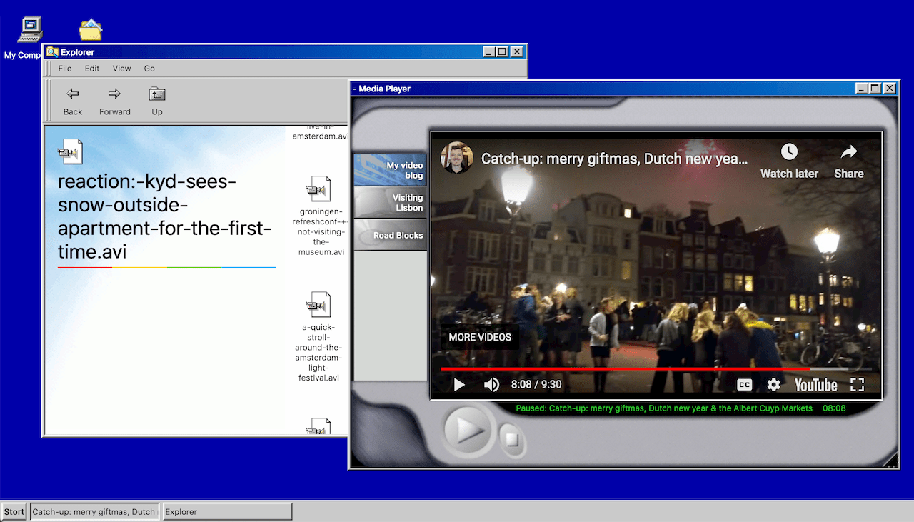

A preact implementation of Windows 95/98 style components and apps. It's a very specific implementation, and probably isn't suitable for your use case.

[👉 Read the docs 👉](https://ui95.ash.ms/)

# Developing

There are three separate projects:

1. Storybook for component development (`npm start`)
1. Docs (`npm run watch-docs`)
1. Example app (`npm run watch-example`)

The final build is automated by `npm run build` when deployed to Netlify.

# Lessons learned

1. React isn't super great for realtime apps. Window management in particular is handled directly in DOM to prevent windows rerendering on every mouse move.
1. This took a fair while to implement, and toward the end I got a little lazy with prop drilling. Windows have far too many dependencies and could benefit from a simpler API.
